# Harumnesia - Architecture Flow Diagram

## Overview
Harumnesia adalah platform rekomendasi parfum lokal Indonesia yang menggunakan arsitektur full-stack dengan integrasi machine learning untuk sistem rekomendasi. Platform ini terdiri dari frontend React, backend Node.js/Express, database MongoDB, dan layanan ML eksternal.

## System Architecture Flow

```mermaid
graph TB
    %% User and Frontend Layer
    subgraph "Client Layer"
        U[👤 User]
        B[🌐 Browser]
    end

    %% Frontend Application
    subgraph "Frontend - React.js"
        FE[⚛️ React App<br/>Vite + TailwindCSS]
        
        subgraph "Pages"
            HOME[🏠 Home]
            CAT[📋 Catalog]
            BRAND[🏪 Brands]
            REC_METHOD[🤔 Recommendation Method]
            REC_FORM[📝 Preference Form]
            SIM_REC[🔍 Similarity Recommendation]
            RES[📊 Results]
            DETAIL[🔍 Perfume Detail]
        end
        
        subgraph "Config"
            API_CONFIG[⚙️ API Configuration]
            ML_CONFIG[🤖 ML Service Config]
        end
    end

    %% Backend API Layer
    subgraph "Backend - Node.js/Express"
        API[🚀 Express Server<br/>Port: 5001]
        
        subgraph "Routes"
            PERF_ROUTES[🧴 Perfume Routes<br/>/api/perfumes]
            BRAND_ROUTES[🏪 Brand Routes<br/>/api/brands]
            INTER_ROUTES[🌍 International Routes<br/>/api/inter]
            ML_PROXY[🤖 ML Proxy<br/>/api/ml/recommend<br/><i>⚠️ Unused by FE</i>]
        end
        
        subgraph "Controllers"
            PERF_CTRL[🧴 Perfume Controller]
            BRAND_CTRL[🏪 Brand Controller]
            INTER_CTRL[🌍 Inter Controller]
        end
        
        subgraph "Models"
            PERF_MODEL[📋 AllPerfume Model]
            BRAND_MODEL[🏪 Brand Model]
            INTER_MODEL[🌍 InterPerfume Model]
        end
    end

    %% Database Layer
    subgraph "Database - MongoDB"
        DB[(🗃️ MongoDB<br/>parfumDB)]
        
        subgraph "Collections"
            PERF_COLL[🧴 allperfumes<br/>Local Perfumes Data]
            BRAND_COLL[🏪 brands<br/>Brand Information]
            INTER_COLL[🌍 interdb<br/>International Perfumes]
        end
    end

    %% External ML Services
    subgraph "External ML Services"
        ML_FORM[🧠 Form-based ML API<br/>ml.harumnesia.web.id]
        ML_SIM[🔍 Similarity ML API<br/>api.harumnesia.web.id]
    end

    %% External Services
    subgraph "External Services"
        DEPLOY[🌐 Deployment<br/>db.harumnesia.web.id]
    end

    %% User Flow Connections
    U --> B
    B --> FE

    %% Frontend Internal Flow
    FE --> HOME
    FE --> CAT
    FE --> BRAND
    FE --> REC_METHOD
    
    REC_METHOD --> REC_FORM
    REC_METHOD --> SIM_REC
    REC_FORM --> RES
    SIM_REC --> RES
    CAT --> DETAIL
    
    %% Frontend to ML Services (Direct Calls)
    ML_CONFIG --> ML_FORM
    ML_CONFIG --> ML_SIM
    
    %% Frontend to Backend API Calls (Data Only)
    API_CONFIG --> PERF_ROUTES
    API_CONFIG --> BRAND_ROUTES
    API_CONFIG --> INTER_ROUTES
    PERF_ROUTES --> PERF_CTRL
    BRAND_ROUTES --> BRAND_CTRL
    INTER_ROUTES --> INTER_CTRL
    
    %% Controller to Model Flow
    PERF_CTRL --> PERF_MODEL
    BRAND_CTRL --> BRAND_MODEL
    INTER_CTRL --> INTER_MODEL
    
    %% Model to Database Flow
    PERF_MODEL --> PERF_COLL
    BRAND_MODEL --> BRAND_COLL
    INTER_MODEL --> INTER_COLL
    
    %% Database Collections in MongoDB
    PERF_COLL --> DB
    BRAND_COLL --> DB
    INTER_COLL --> DB

    %% Deployment
    API --> DEPLOY

    %% Styling
    classDef frontend fill:#61dafb,stroke:#21759b,stroke-width:2px,color:#000
    classDef backend fill:#68a063,stroke:#4f7942,stroke-width:2px,color:#fff
    classDef database fill:#47a248,stroke:#3d8b40,stroke-width:2px,color:#fff
    classDef ml fill:#ff6b6b,stroke:#cc5555,stroke-width:2px,color:#fff
    classDef external fill:#feca57,stroke:#ff9f43,stroke-width:2px,color:#000

    class FE,HOME,CAT,BRAND,REC_METHOD,REC_FORM,SIM_REC,RES,DETAIL,API_CONFIG,ML_CONFIG frontend
    class API,PERF_ROUTES,BRAND_ROUTES,INTER_ROUTES,ML_PROXY,PERF_CTRL,BRAND_CTRL,INTER_CTRL,PERF_MODEL,BRAND_MODEL,INTER_MODEL backend
    class DB,PERF_COLL,BRAND_COLL,INTER_COLL database
    class ML_FORM,ML_SIM ml
    class DEPLOY external
```

## Detailed Data Flow

### 1. User Browsing Flow

### 2. Recommendation Flow (Form-based)

### 3. Similarity Recommendation Flow

## Technology Stack

### Frontend Stack
- **Framework**: React 19.1.0 with Vite 6.3.5
- **Styling**: TailwindCSS 3.3.3 + Custom CSS
- **Routing**: React Router DOM 7.6.0
- **Icons**: Heroicons React 2.2.0
- **State Management**: React Hooks (useState, useEffect)

### Backend Stack
- **Runtime**: Node.js
- **Framework**: Express.js 5.1.0
- **Database ODM**: Mongoose 8.15.0
- **CORS**: cors 2.8.5
- **Environment**: dotenv 16.5.0
- **HTTP Client**: node-fetch 3.3.2

### Database
- **Database**: MongoDB
- **Collections**:
  - `allperfumes` - Local Indonesian perfumes
  - `brands` - Perfume brand information
  - `interdb` - International perfumes data

### External Services
- **Form-based ML API**: `https://ml.harumnesia.web.id`
- **Similarity ML API**: `https://api.harumnesia.web.id`
- **Production Backend**: `https://db.harumnesia.web.id`

## API Endpoints Overview

### Perfume Endpoints
- `GET /api/perfumes` - Get all perfumes
- `GET /api/perfumes/:id` - Get perfume by ID
- `GET /api/perfumes/page/:page` - Get paginated perfumes
- `GET /api/perfumes/brand/:brandName` - Get perfumes by brand
- `GET /api/perfumes/brands` - Get all brand names

### Brand Endpoints
- `GET /api/brands` - Get all brands
- `GET /api/brands/:id` - Get brand by ID
- `GET /api/brands/:id/perfumes` - Get perfumes for specific brand

### International Perfume Endpoints
- `GET /api/inter/perfumes` - Get international perfumes
- `GET /api/inter/brands` - Get international brands
- `GET /api/inter/search` - Search international perfumes

### ML Integration
- `POST /api/ml/recommend` - ML proxy endpoint (exists but unused by frontend)
- Direct frontend calls to form-based ML service (`ml.harumnesia.web.id`)
- Direct frontend calls to similarity ML service (`api.harumnesia.web.id`)

## Key Features

### Architecture Patterns
- **Direct ML Integration**: Frontend makes direct calls to external ML services for recommendations
- **Data API Separation**: Backend serves only data operations (CRUD) for perfumes, brands, and international data
- **Microservices Approach**: ML recommendation services are deployed as separate external APIs
- **Client-Side Orchestration**: Frontend handles the orchestration between data APIs and ML services

### 1. Recommendation System
- **Form-based Recommendations**: User fills preferences form
- **Similarity Recommendations**: Based on liked perfumes
- **ML Integration**: External Python/Flask ML services
- **Hybrid Approach**: Combines content-based filtering

### 2. Perfume Catalog
- **Search & Filter**: Real-time search functionality
- **Pagination**: Efficient data loading
- **Brand Navigation**: Browse by brand
- **Detailed Views**: Complete perfume information

### 3. User Interface
- **Responsive Design**: Mobile-first approach
- **Modern UI**: TailwindCSS with custom animations
- **Accessibility**: Semantic HTML and ARIA labels
- **Performance**: Optimized loading and caching

## Deployment Architecture

```mermaid
graph LR
    subgraph "Production Environment"
        FE_PROD[📱 Frontend<br/>Static Hosting]
        BE_PROD[🚀 Backend API<br/>db.harumnesia.web.id]
        DB_PROD[(🗃️ MongoDB<br/>Cloud/Atlas)]
        ML_PROD1[🧠 ML Service 1<br/>ml.harumnesia.web.id]
        ML_PROD2[🔍 ML Service 2<br/>api.harumnesia.web.id]
    end
    
    FE_PROD --> BE_PROD
    BE_PROD --> DB_PROD
    FE_PROD --> ML_PROD1
    FE_PROD --> ML_PROD2
    BE_PROD --> ML_PROD1
```

## Development Workflow

### Local Development
1. **Frontend**: `npm run dev` (Vite dev server)
2. **Backend**: `npm run dev:server` (Nodemon)
3. **Full Stack**: `npm run dev:full` (Concurrent)
4. **Database**: Local MongoDB or remote connection

### Testing
- ML service testing scripts available
- API endpoint testing
- Integration testing for recommendation flow

This architecture provides a scalable, maintainable solution for the Harumnesia perfume recommendation platform with clear separation of concerns and efficient data flow.
